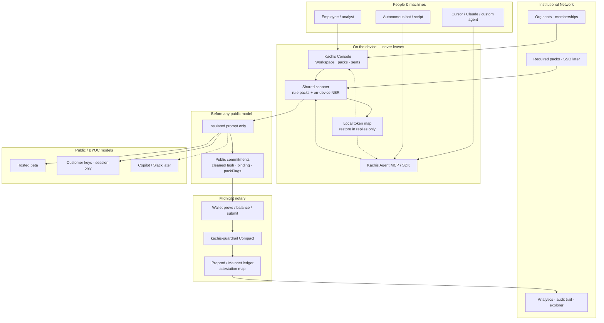

# Kachis

**Local data shield for corporate AI.** Secrets stay on the device. Only a cleaned prompt can reach a model. Midnight records that the shield pack ran — without publishing the file.

---

## The problem

Teams paste payroll, contracts, source, and client notes into ChatGPT, Copilot, Claude, and agent tools every day.

If that **chat history leaked** tomorrow — vendor breach, rogue seat, misconfigured retention — how cooked is the company?

The leak is not “the model trained on us.” It is the **conversation log**: emails, SSNs, API keys, deal terms, client names sitting in a third-party store the CISO never approved.

Companies already buy DLP for email and drives. They still have almost nothing between a paste box and a public model. Kachis is that control plane:

1. **Stop the leak** — scan and insulate on the device before anything leaves.
2. **Prove the pack ran** — a public receipt that filters ran, without showing the original.
3. **Make it unskippable** — humans and agents take the same path; the model never sees the raw paste.

```
Paste / agent job  →  Kachis (scan locally + commitment)  →  only then the LLM
```

---

## Fully fledged Kachis

Target shape when all waves land — console, agent gateway, and org policy on one loop:



Today the **console**, **shared scanner**, **MCP agent**, and **live Preprod `shield()` settle** are real. Copilot/Slack connectors, full DLP parity, and SSO are later waves.

---

## Repository structure

| Path | Role |
|---|---|
| `app/` | Next.js routes — landing, onboarding, workspace, analytics, integrations, APIs |
| `components/` | Console UI |
| `shared/` | Scanner + NER + commitments — used by console **and** agent |
| `lib/` | Wallet, settle, org seats, copy, Midnight helpers |
| `compact/` | Compact contract source + compile scripts |
| `agent/` | Kachis Agent MCP server (`kachis_shield`, `kachis_restore`) |
| `supabase/` | Wallet-bound profiles / orgs / memberships schema |
| `data/` | Seed Preprod settlement proof (judges) |
| `public/wallets/` | Wallet icons |

UI strings live in `copy.md` / `lib/copy.ts`. Product truth for contributors: `product.md`.

---

## Wave 1 — delivered

Critical path that works today:

| Capability | Status |
|---|---|
| Local rule-pack scan (PII, financial, secrets, code, client) | Shipped |
| On-device ML NER (person / org / place) with soft regex fallback | Shipped |
| Enumerated insulation tokens + local-only reply restore | Shipped |
| SHA-256 cleaned commitment + binding (original never posted) | Shipped |
| Compact `kachis-guardrail` + live Preprod `shield()` settle | Shipped |
| Wallet connect (1AM recommended; Lace / Gero / Ctrl discovered) | Shipped |
| Chat gated on recorded commitment + prompt hash match | Shipped |
| Public notary log (`/api/shield`) merged with Preprod ledger | Shipped |
| Kachis Agent MCP (`kachis_shield` / `kachis_restore`) | Shipped |
| Wallet-bound org seats (Supabase) + onboarding funnel | Shipped |
| Beta hosted Gemini + BYOC (keys in session only) | Shipped |
| Analytics quarter view + Integrations (MCP install) | Shipped |
| Walkthrough `/demo` (no wallet) + live `/workspace` settle | Shipped |

Honest limits in Wave 1: MCP does not yet submit Compact txs; local SHA-256 binding ≠ in-circuit `persistentHash`; on-chain `requiredPack` needs Compact recompile + **v1** deploy; Gero cannot balance contract txs yet.

---

## Wave 2 — next

| Milestone | Intent |
|---|---|
| Redeploy `kachis-guardrail` **v1** with on-chain `requiredPack` | Institutional pack assert on Preprod |
| MCP Compact submit | Agents settle the same receipt as the console |
| Align or document hash story | Clear mapping between local binding and circuit `persistentHash` |
| Company NER lists / richer detectors | Closer to DLP parity without leaving the device |
| Invite-link org join + multi-admin | Real institutional seating |
| Lace proof-server UX polish | Settle path when 1AM is unavailable |

---

## Wave 3 — later

| Milestone | Intent |
|---|---|
| Copilot / Teams / Slack connectors | Meet users where they already paste |
| SSO / IdP (email, GitHub, enterprise IdP) | Wallet-optional seats for IT |
| Enterprise gateway / sidecar installer | Unskippable path for managed fleets |
| Mainnet deploy + production ops | Beyond Preprod |
| Cryptographic wallet challenge sessions | Stronger than address-bound API calls |
| Autonomous agent Passport product | First-class machine seats beyond MCP |

Update these tables as milestones ship.

---

## Contract versions

| Version | Name | Preprod address | Notes |
|---|---|---|---|
| **v0** | `kachis-guardrail` (Wave 1) | `d145333b792908a93fe7abacf5753ba8e63ecc6291bc76a901ebfed8f5f9f24f` | Original settle proof below. |
| **v0.1** | empty-ctor redeploy | `2440ed058a4ce3eb4f19fed09c7a09626e009b912a1b9293b61e55750ae676cd` | Pre-recompile instance (no on-chain `requiredPack`). |
| **v1-institutional** | `requiredPack=31` | `ec898ae76d13cf947ed6f7c342c54f9f54cea447d0a113a40d7a980d5aa34d75` | **Live for Institutional.** All five filters required on settle. |
| **v1-sandbox** | `requiredPack=0` | `16106cf6655663a8879a98ac071ce412c641b181d1a24af9e06a1f15f619b910` | **Live for Sandbox.** Any packFlags allowed. |

Seat tier picks the instance: Solo Sandbox → sandbox contract; Institutional Node → institutional contract. Keep `NEXT_PUBLIC_KACHIS_FORCE_REDEPLOY=0` so settles call `shield()` on the pinned address and do **not** redeploy.

[Explorer — sandbox](https://preprod.midnightexplorer.com/contracts/16106cf6655663a8879a98ac071ce412c641b181d1a24af9e06a1f15f619b910) · [Explorer — institutional](https://preprod.midnightexplorer.com/contracts/ec898ae76d13cf947ed6f7c342c54f9f54cea447d0a113a40d7a980d5aa34d75)

---

## Setup

**Node 20** runs the UI. Midnight.js settle prefers **Node 22**.

```bash
npm install
cp .env.example .env.local
npm run dev
```

`npm run dev` uses **Webpack** (`next dev --webpack`). Ledger WASM (`CostModel`) does not initialize under Turbopack — use `npm run dev:turbo` only for UI-only work.

### Environment

| Variable | Purpose |
|---|---|
| `GEMINI_API_KEY` | Hosted beta replies (shared daily pool) |
| `KACHIS_BETA_CHAT_LIMIT` | Beta replies per UTC day (default 10) |
| `NEXT_PUBLIC_SUPABASE_URL` + `SUPABASE_SERVICE_ROLE_KEY` | Org / onboarding persistence — run `supabase/schema.sql` |
| `NEXT_PUBLIC_MIDNIGHT_NETWORK` | `preprod` |
| `NEXT_PUBLIC_KACHIS_CONTRACT_ADDRESS_SANDBOX` | Solo Sandbox Preprod instance (`requiredPack=0`) |
| `NEXT_PUBLIC_KACHIS_CONTRACT_ADDRESS_INSTITUTIONAL` | Institutional Preprod instance (`requiredPack=31`) |
| `NEXT_PUBLIC_MIDNIGHT_PROOF_SERVER_URL` | Lace only — e.g. `http://127.0.0.1:6300` |
| `KACHIS_REQUIRED_PACK` | Soft API pack gate (`0` sandbox, `31` all packs) |

BYOC keys are pasted in the console (session memory). Do not put user keys in `.env`.

### Open the app

| URL | Path |
|---|---|
| [http://localhost:3000/onboarding](http://localhost:3000/onboarding) | Connect wallet → Solo Sandbox or Institutional Node |
| [http://localhost:3000/workspace](http://localhost:3000/workspace) | Live shield → settle → send |
| [http://localhost:3000/demo](http://localhost:3000/demo) | Walkthrough — canned paste, **no wallet** |

Workspace flow: **Run Kachis Scanner** → **Approve & Settle Shield** → **Confirm & Send**.

### Kachis Agent (MCP)

```bash
cd agent
npm install
npm start
```

Copy `agent/mcp.example.json` into your MCP host settings, or use **Integrations** in the console. Host must call `kachis_shield` and send **only** `shielded_prompt` to the model. After the reply, call `kachis_restore` on-device.

---

## Compact compile

Windows: use **WSL**. Native Windows cannot run Compact. Language `0.23` pairs with compiler **0.31.x**.

```bash
# in WSL / Linux / macOS, from the repo root
chmod +x compact/compile.sh
./compact/compile.sh
```

That writes `compact/managed/kachis-guardrail` including proving keys. The console serves them at `/zk/kachis-guardrail/…`. CI: `.github/workflows/compact-compile.yml`.

Details: [`compact/README.md`](compact/README.md). License: Apache 2.0 (`LICENSE`).

### Settle a job (funded Preprod wallet)

1. Install **1AM** (recommended), Lace, or Gero; enable Midnight; faucet **tNIGHT**; wait for **DUST**.
2. Proofs: **1AM in-wallet proving** (no Docker), **or** Lace with a local/remote proof server (`docker run -p 6300:6300 midnightntwrk/proof-server:8.1.0 midnight-proof-server -v`) / `NEXT_PUBLIC_MIDNIGHT_PROOF_SERVER_URL`. Gero Cloud can prove but cannot balance contract txs yet.
3. Compile the contract (above).
4. Restart with `npm run dev` (webpack). Open Workspace (`/workspace`), connect the wallet, confirm fee reserve, paste, Run Kachis Scanner, then Approve & Settle. If settlement fails, nothing is recorded and Confirm & Send stays locked. For a wallet-free path, use Walkthrough (`/demo`).
5. Guide rail shows a **settlement id** on success.

Optional: pin both Preprod instances so later sessions skip deploy.

```bash
cp .env.example .env.local
# GEMINI_API_KEY + KACHIS_BETA_CHAT_LIMIT=10 for hosted beta responses
# BYOC keys are pasted in Identity / Workspace — never put user keys in .env
# optional NEXT_PUBLIC_MIDNIGHT_PROOF_SERVER_URL=http://127.0.0.1:6300
# NEXT_PUBLIC_KACHIS_CONTRACT_ADDRESS_SANDBOX=16106cf6655663a8879a98ac071ce412c641b181d1a24af9e06a1f15f619b910
# NEXT_PUBLIC_KACHIS_CONTRACT_ADDRESS_INSTITUTIONAL=ec898ae76d13cf947ed6f7c342c54f9f54cea447d0a113a40d7a980d5aa34d75
# NEXT_PUBLIC_KACHIS_FORCE_REDEPLOY=0
```

---

## Live Preprod proof

### Wave 1 (v0)

Compact `shield()` settled on **Preprod** with **1AM** (wallet-local proving — no Docker proof server). Public commitments only; the original paste never left the machine.

| Field | Value |
|---|---|
| Public commitment id | `#1` |
| Cleaned commitment | `0x0c04d0a3c1795eb8702f5332f82013283b7d309dea132a16d6a3f8f5e51ff76b` |
| Binding | `0x6807cf9e5b2963e78096d670398952886e98dfd8f5a8f4c137f151eb203640ec` |
| Settlement id | `0004be65181b38108650c2b392b6bae4e99fff26a163c858b46d7577dda156d1ac` |
| Tx hash | `dc7080a02d8a22e4be3d7992174aed9fd9e73b28abdef2c4fe37db8f4f9823db` |
| Contract (v0) | `d145333b792908a93fe7abacf5753ba8e63ecc6291bc76a901ebfed8f5f9f24f` |
| Network | Preprod |
| Seat (unshielded) | `mn_addr_preprod12sxshhkun6zmk5vdt8acw9lp7nylufj20enwg4ss56dr7v9cz5ms5t8rdu` |

- [Transaction (Wave 1)](https://preprod.midnightexplorer.com/transactions/dc7080a02d8a22e4be3d7992174aed9fd9e73b28abdef2c4fe37db8f4f9823db)
- [Contract v0](https://preprod.midnightexplorer.com/contracts/d145333b792908a93fe7abacf5753ba8e63ecc6291bc76a901ebfed8f5f9f24f)
- [Block #2476854](https://preprod.midnightexplorer.com/blocks/2476854)
- [Seat on Subscan](https://midnight-preprod.subscan.io/account/mn_addr_preprod12sxshhkun6zmk5vdt8acw9lp7nylufj20enwg4ss56dr7v9cz5ms5t8rdu) (unshielded address only)

### v1-sandbox (current Solo path)

| Field | Value |
|---|---|
| Contract | `16106cf6655663a8879a98ac071ce412c641b181d1a24af9e06a1f15f619b910` |
| Tx hash | `7a26ad5ae7d9e262c641edbe491398fd63bc6e60cf21f565bbca3987313e829f` |
| Network | Preprod |
| Constructor | `requiredPack=0` |

- [Transaction](https://preprod.midnightexplorer.com/transactions/7a26ad5ae7d9e262c641edbe491398fd63bc6e60cf21f565bbca3987313e829f)
- [Contract v1-sandbox](https://preprod.midnightexplorer.com/contracts/16106cf6655663a8879a98ac071ce412c641b181d1a24af9e06a1f15f619b910)
- [Contract v1-institutional](https://preprod.midnightexplorer.com/contracts/ec898ae76d13cf947ed6f7c342c54f9f54cea447d0a113a40d7a980d5aa34d75)

Analytics / Recent audits call `GET /api/shield`, which **reads the contract ledger from Preprod** (cleanedHash, binding, packFlags) and merges local findings. Explorer links use Midnight Explorer + `txHash`.

Status: **Settled.** The pack ran; the original stays on this machine.

---

## Demo path

- **Walkthrough:** landing → `/demo` → Run Kachis Scanner → Approve & Settle (simulated) → Confirm & Send (canned reply).
- **Live settle:** `/workspace` → Connect **1AM** → paste → Run Kachis Scanner → Approve & Settle → Confirm & Send.

Live Preprod settlement: see **Live Preprod proof** above ([sandbox tx](https://preprod.midnightexplorer.com/transactions/7a26ad5ae7d9e262c641edbe491398fd63bc6e60cf21f565bbca3987313e829f)).

---

## Stack

Next.js 16 · React 19 · Tailwind v4 · TypeScript · Midnight.js 4.1.1 · Compact 0.23 / compiler 0.31.x · Transformers.js NER · Supabase (optional seats).
